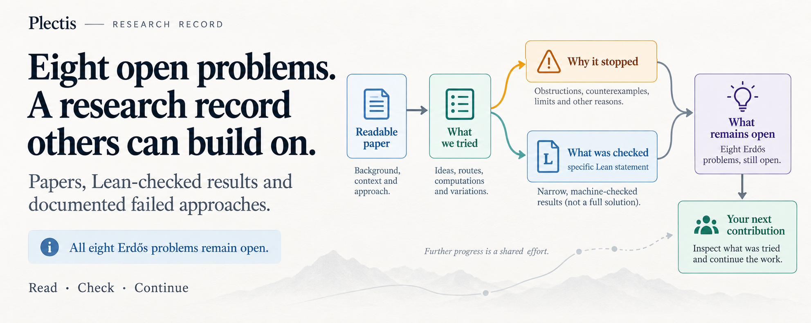

<!-- SPDX-FileCopyrightText: 2026 Will Cook -->
<!-- SPDX-License-Identifier: Apache-2.0 -->

# Plectis: a public frontier across eight open Erdős problems



Plectis applies AI search, computation, ordinary mathematics, and Lean to eight
long-standing open Erdős problems: 68, 243, 249, 251, 257, 269, 1041, and 1049.
**All eight problems remain open.** This repository does not solve any of them.
They were chosen on the expectation that a solo, self-funded undergraduate
project would not. The object is to measure how much exact, machine-checked,
reusable progress can be accumulated on problems of this difficulty, and to
publish it so another researcher can continue.

What is published is each problem's current frontier: exact reductions, checked
theorems, countermodels, no-go results, finite certificates, failed routes, and
the obligation that still blocks the endpoint. The pinned Lean kernel checks the
exact formal statement of each accepted result. It does not establish that a
statement expresses the intended mathematics, that a result is new, or that it
matters; those are authored judgements.

Large-language-model agents drafted prose, Lean proofs, and software. Will Cook
set the objectives, reviewed the public claims and cited sources, and is
responsible for the release.

If you solve one of the eight problems, the result and the credit are yours. I
ask only that, if this repository or Plectis materially helped, you cite the
release and say that it helped. The public contribution record keeps the
solver, collaborators, prior work, tools, and infrastructure roles separate;
using this system does not transfer authorship of a proof to me.

For a first Lean proof check, install `elan` from the
[Lean setup guide](https://leanprover-community.github.io/get_started.html),
then use the proof-only checkout. It skips the large generated-document tree
and obsolete historical blobs:

```bash
git clone --depth=1 --filter=blob:none --single-branch --no-checkout https://github.com/wcook04/plectis-lean-erdos249-257.git
git -C plectis-lean-erdos249-257 show HEAD:scripts/lean-quick-sparse-checkout | git -C plectis-lean-erdos249-257 sparse-checkout set --no-cone --stdin
git -C plectis-lean-erdos249-257 checkout
cd plectis-lean-erdos249-257
python3 scripts/lean_fast_build.py --jobs 2 \
  ErdosProblems.Erdos249.PeriodMultipleEscape
```

The quick manifest checks out the focused module's exact 43-module dependency
cone instead of all 1,042 Lean files. It does not make Git fetch the root PDFs,
generated-document tree, or unrelated proof modules before the sparse rules
exist. The wrapper fetches the pinned dependency cache only when needed, reuses
compatible host packages across clones, and joins duplicate concurrent builds.
Successful identical builds also reuse bounded copy-on-write output seeds
across clones. The focused command checks a real published theorem module
without first elaborating every generated certificate.
Use the full six-target command in
[the release reproduction guide](docs/REPRODUCIBILITY.md#2-reproduce-the-lean-environment)
only when you intend to replay the complete public proof environment.

To expand the same checkout to every public Lean source first:

```bash
git -C plectis-lean-erdos249-257 show HEAD:scripts/lean-sparse-checkout | git -C plectis-lean-erdos249-257 sparse-checkout set --no-cone --stdin
git -C plectis-lean-erdos249-257 checkout
```

To inspect the papers, claims, open boundaries, and contribution route without
installing Lean, use the reader checkout. It avoids the machine-scale generated
corpora as well as obsolete history:

```bash
git clone --depth=1 --filter=blob:none --single-branch --no-checkout https://github.com/wcook04/plectis-lean-erdos249-257.git
git -C plectis-lean-erdos249-257 show HEAD:scripts/reader-sparse-checkout | git -C plectis-lean-erdos249-257 sparse-checkout set --no-cone --stdin
git -C plectis-lean-erdos249-257 checkout
cd plectis-lean-erdos249-257
```

Start with [A reader's way in](HUMAN_ENTRY.md), then choose one of the eight
problem papers below. The complete checkout adds the machine query corpus and
`python3 scripts/query_corpus.py --overview --format card`.

Cloning does not run project code. This repository defines no submodules, Git
LFS filters, or repository hooks. Running the query above executes tracked
Python; building proofs also executes the pinned Lean toolchain and Mathlib
dependency. [SECURITY](SECURITY.md) explains that trust boundary and how to
report a concern privately.

To query the complete current generated corpus without downloading historical
revisions:

```bash
git clone --depth=1 --filter=blob:none --single-branch https://github.com/wcook04/plectis-lean-erdos249-257.git
cd plectis-lean-erdos249-257
```

Only release validation needs the complete history for pinned-source checks.
It can still avoid eagerly downloading obsolete blobs:

```bash
git clone --filter=blob:none --single-branch https://github.com/wcook04/plectis-lean-erdos249-257.git
cd plectis-lean-erdos249-257
```

A single claim can be followed without installing Lean:

```bash
python3 scripts/verify_claims.py --claim eb_full_support
```

It prints the statement, re-resolves its declaration, names any Comparator
interface and paper, and states where the claim stops. `--verify-all` checks
every claim record in under a second.

For a command-free first read, begin with
[A reader's way in](HUMAN_ENTRY.md). The
[architecture and repository guide](ARCHITECTURE.md) and its
[printable PDF](claim-faithful-publication-systems-paper.pdf) assume no Lean or
project history.

## What is here

One paper per problem, each with its checked frontier and its open obligation.

## Problem papers

[**#68**](erdos-68-factorial-denominator-irrationality.pdf) reduces irrationality
to one integer divisibility test failing infinitely often. Producing infinitely
many failures remains open.

[**#243**](erdos-243-reciprocal-tail-rigidity.pdf) takes normalised vanishing
from Koizumi and excludes a bounded negative part. The missing negative-part
bound and the unbounded mixed-sign regime remain open.

[**#249**](erdos-249-binary-totient-series.pdf) gives explicit rational bases for
the dyadic sections of Euler's totient, exact level rank `2ᵉ + 1`, denominator
exclusion to about `7.96 × 10³⁴`, and diagonal certificates for every `t ≤ 82`.
No unbounded producer is proved.

[**#251**](erdos-251-prime-gap-dyadic-series.pdf) checks summability and the
prime-gap identity, and makes irrationality equivalent to cofinal non-integral
tail shifts. The concrete prime-tail bridge remains open.

[**#257**](erdos-257-mersenne-support-subseries.pdf) checks full support,
finite-period noncollapse, and the coding, topology, perfectness and measure of
the Mersenne achievement set. The universal statement and the `1/2` and `1/21`
targets remain open.

[**#269**](erdos-269-three-prime-running-lcm.pdf) records that for two primes both
sums are transcendental by a paper argument. **This is not first and not
formalised.** Steve Fan posted the same argument on the erdosproblems.com #269
page on 26 June 2026 and this note was first released on 22 July 2026, so no
priority is claimed and no Lean declaration asserts it. From three primes the
problem remains open.

[**#1041**](erdos-1041-lemniscate-newton-flow.pdf) checks Newton-flow value decay,
ray separation, the translation collision locus, and root retention. A recent
claimed decomposition has an invalid printed local saddle block; repairing the
topology and metric gluing remains open.

[**#1049**](erdos-1049-rational-base-lambert.pdf) checks construction-specific
no-go theorems and four-jet cancellation at base `3/2`. It proves no
irrationality result, and the primitive construction remains open.

## What the checks establish

Nineteen selected propositions are declared a second time, without proofs, and
Comparator checks the proof-bearing modules against those declarations and a
fixed axiom budget; an adversarial fixture alters one statement and must be
rejected. [`formalization.yaml`](formalization.yaml) records the contribution
class, statement, source declaration, boundary, `sorry` count, and axioms per
result, and the [verification packet](docs/EXTERNAL_VERIFICATION.md) covers all
eight problem programmes. Comparator checks propositions only: no paper
deduction, cited theorem, external computation, meaning, novelty, or
significance.

Status labels are descriptions, not scores: **formalised here** is a checked
rendering and never a priority claim, **proved here** means the argument is this
project's, and a **conditional reduction** depends on a named open condition.

| Status | Result |
|---|---|
| **formalised here** | For every integer `b ≥ 2` the full-support series `∑ 1/(bⁿ − 1)` is irrational, and the Mersenne achievement set is compact, perfect, totally disconnected, nowhere dense, and of measure one. |
| **proved here** | `S = ∑ φ(n)/2ⁿ` is irrational exactly when every positive binary tail difference is non-integral; certificates at arbitrarily large stages are not proved. |
| **verified finite instance** | A diagonal certificate is checked at every `t ≤ 82`, which proves nothing beyond a fixed cutoff. |
| **conditional reduction** | Two middle coordinates of the #257 last-skip schema wait on an inequality that is not proved. |

[`docs/claims.json`](docs/claims.json) owns every claim record and its status,
[`docs/PALOMAR_RESULT_SHOWCASE.json`](docs/PALOMAR_RESULT_SHOWCASE.json) owns the
reader-priority ranking, and [prior art](docs/PRIOR_ART.md) records classical,
subsuming, and earlier public work.

`v0.9.0` is the latest tagged release and citation anchor, and
[`docs/claims.json`](docs/claims.json) pins the formal-source checkpoint it
ships. This is a self-contained public checkout and is not an entrypoint into
any private development system: Lean source checked by the pinned kernel is the
proof authority here, and do not infer results from private or unreleased work.

## Read or run it

The reading order is [RESULTS](docs/RESULTS.md), [SCOPE](SCOPE.md), the
[source map](docs/SOURCE_MAP.md), and [prior art](docs/PRIOR_ART.md).
[METHODOLOGY](METHODOLOGY.md) governs claim changes. Building the Lean source
needs the pinned toolchain and is described in the
[architecture guide](ARCHITECTURE.md); everything above needs Python alone.

[`examples/Examples.lean`](examples/Examples.lean) is the minimal downstream
consumer; its conditional shell-pressure example leaves the analytic hypothesis
explicit and does not prove universal #257.

An agent arriving cold reads [`AGENTS.override.md`](AGENTS.override.md), then
runs `python3 scripts/agent_entry.py --entry "<task in ordinary language>"` as
its first action and follows the bounded read set it returns. The
[`docs/orientation.json`](docs/orientation.json) projection is a later route
when selected, not the task router.
[The Agent Workbench](docs/AGENT_WORKBENCH.md) records typed reasoning moves and
kernel probes; only kernel receipts assert.

The repository began with #249 and #257 and keeps that name so old citations
resolve. The [joint #249/#257 manuscript](erdos249-257-main-paper.pdf) and the
two claim-bounded reasoning surfaces
([#249](erdos249-totient-reasoning-surface.pdf),
[#257](erdos257-mersenne-reasoning-surface.pdf)) are kept
for archive and provenance, not as a reading route; the per-problem papers are
the live route.
The [agent-navigation paper](cold-clone-to-proof-receipt.pdf) audits the
cold-clone route.

## Citation and licence

Citation metadata for `v0.9.0` is in [`CITATION.cff`](CITATION.cff). Code,
scripts, and documentation are Apache-2.0; the manuscript layer is CC-BY-4.0, and
[`REUSE.toml`](REUSE.toml) is complete. Corrections are received through the
issue forms; [`CONTRIBUTING.md`](CONTRIBUTING.md) explains the local checks and
credit route, [`CODE_OF_CONDUCT.md`](CODE_OF_CONDUCT.md) states the participation
standard, and [`SECURITY.md`](SECURITY.md) gives the private route.

<!-- BEGIN generated_corpus_at_a_glance -->
<!-- Generated by scripts/build_corpus_descriptor.py; do not edit this region. -->
## Corpus at a glance

The layer a mathematician should judge is small: 130 curated claim records in 30 contribution families, reaching Lean source through 404 principal declaration links. `SCOPE.md` gives its shape and `docs/RESULTS.md` gives the strongest checked result per problem.

The rest is engineering inventory. About 93% of the 153,671 declarations (142,668 across 683 modules) are machine-emitted certificate shards: one integer checked prime, one position excluded. The remainder is not all hand-written either.

| Engineering inventory | Current size |
|---|---:|
| Lean modules (the two library roots) | 1,044 |
| Formal results and supporting lemmas | 151,397 |
| Curated claim records | 130 |
| Contribution families | 30 |

Generated shards are counted as formal source and never as separate
mathematical claims. Claim records span every status, including cited and
open, and are partitioned exactly once.
These are navigation counts, not novelty claims.
<!-- END generated_corpus_at_a_glance -->

<!-- BEGIN generated_principal_declaration_anchors -->
<!-- Generated by scripts/build_corpus_descriptor.py; do not edit this region. -->
## Following a result into Lean

The paper links each headline result to the relevant source. For a particular
topic, start with the [source map](docs/SOURCE_MAP.md); it gives the module
order without asking you to decode Lean declaration names first.
<!-- END generated_principal_declaration_anchors -->

## Where I actually am

[Where I actually am](HUMAN_ENTRY.md#where-i-actually-am) says who wrote this and
why it was released in the state it is in. The
[routes are on the site](https://wcook04.github.io/plectis/#contact).
