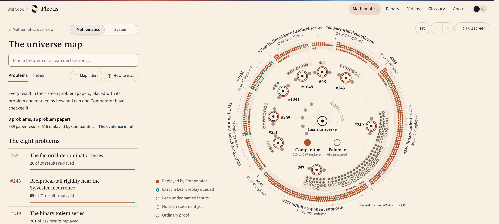

<!-- SPDX-FileCopyrightText: 2026 Will Cook -->
<!-- SPDX-License-Identifier: Apache-2.0 -->

# Plectis

### Open mathematical research

Eight Erdős problems, with papers to read, proofs to inspect and research to continue.

**[Explore the website](https://wcook04.github.io/plectis/maths/)** ·
**[Open the maths map](https://wcook04.github.io/plectis/maths/universe.html)** ·
**[Read the papers](paper/README.md)**

The maths map on 8 October 2026. Open the image to explore the current edition.

Plectis is an independent, AI-assisted prototype built and maintained by Will Cook.
The website lets you explore the research. This repository contains the arguments,
Lean proofs, experiments and approaches that did not work. You can read everything
without installing Lean. [A reader's way in](docs/READING_GUIDE.md) introduces the
project; the [glossary](https://wcook04.github.io/plectis/docs/glossary.html) explains
mathematical terms along the way.

---

## For a first look: #257

[Problem 257](https://www.erdosproblems.com/257) asks whether the series

$$\sum_{a\in A} \frac{1}{2^a-1}$$

is irrational for **every infinite set $A$ of positive integers**. The universal
question remains open.

The [short paper](paper/257/erdos-257-mersenne-support-subseries.pdf) proves sufficient conditions for particular infinite sets, including a
Lean-checked prime-weighted criterion that works at every integer base at
least two. Cancellation removes a finite batch of terms; averaging controls
what the remaining terms leave behind.

[Read the argument](paper/257/erdos-257-mersenne-support-subseries.pdf),
[try three changed hypotheses](docs/reading-edition/weighted-257-task.md), or
[follow the Lean declaration](lean/ErdosProblems/Erdos257/PaperCompleteR8/WeightedReturn.lean#L120).
The [longer record](paper/257/erdos257-mersenne-reasoning-surface.pdf) preserves
other approaches and where they stop.

## Results and their limits

Using the degree-seven polynomial constructed by the erdosproblems.com
contributor ani, Lean proves that every preconnected strict-lemniscate set
containing two distinct roots has one-dimensional Hausdorff measure greater
than two. This refutes the exact Formal Conjectures path-image-length
statement; the separate total-variation bound is also checked. The other
seven targets remain open. Independent human review of correspondence with
the 1958 wording has not been recorded. Comparator checks only selected exact
statements, axioms and kernel acceptance; it does not assess novelty or
historical correspondence.

[ani's original counterexample](https://www.erdosproblems.com/forum/thread/1041#post-8861)
is credited in the [#1041 case study](docs/case-studies/formal-conjectures-1041.md).
[Results and limits](docs/RESULTS.md) keeps each programme's statements beside
its assumptions, earlier work and remaining questions.

## Read, inspect or continue

> **[Choose a question](https://wcook04.github.io/plectis/maths/universe.html)** → **[Read a paper](paper/README.md)** → **[Follow its evidence](docs/SOURCE_MAP.md)** 
> Papers lead to exact statements, selected Lean proofs, experiments and [open questions](docs/RESULTS.md).

- **Read and understand.** [A reader's way in](docs/READING_GUIDE.md) introduces
  the questions. The [reading edition](docs/reading-edition/README.md) gathers
  the paper openings in one file, suitable for reading or sharing with an AI.
- **Inspect or reproduce.** [Follow one claim](docs/REPRODUCIBILITY.md#try-one-claim-without-lean)
  with Git and Python, or [rerun an exact-rational experiment](docs/REPRODUCIBILITY.md#reproduce-the-257-exact-rational-example).
  That finite experiment does not reproduce the weighted theorem above.
- **Work with an agent.** The [agent quickstart](docs/agents/README.md#start-with-current-public-work)
  gives clone commands and a copyable prompt. Ask it to explain an argument,
  explore an open question or improve a tool. The repository includes its
  instructions and links to the evidence.

## Why keep the whole research record?

I want other people to work on these questions with me. The longer records
include calculations and routes that stopped at a precise obstruction. You can
question an approach, repair it or use the idea elsewhere without repeating
the investigation.

AI agents did most of the research and drafting. I built and directed the
infrastructure and reviewed claims when I could; I have not independently
verified every claim. I maintain the sources and take responsibility for
correcting the public record. Novelty and significance need human judgement;
independent mathematical review of the corpus has not been recorded.
The [system paper](paper/systems/claim-faithful-publication-systems-paper.pdf)
explains how the repository records results and corrections and credits contributors.

## Problem papers

The [results guide](docs/RESULTS.md#problem-by-problem-guide) lists each result
with its assumptions, limits and sources.

| Problem | Topic | Papers |
|---|---|---|
| [#68](https://www.erdosproblems.com/68) | [Factorial-denominator irrationality](https://wcook04.github.io/plectis/maths/problems/erdos_68.html) | [short paper](paper/68/erdos-68-factorial-denominator-irrationality.pdf) · [longer paper](paper/68/erdos68-factorial-reasoning-surface.pdf) |
| [#243](https://www.erdosproblems.com/243) | [Cubic-rate irrationality and reciprocal tails](https://wcook04.github.io/plectis/maths/problems/erdos_243.html) | [short paper](paper/243/erdos-243-reciprocal-tail-rigidity.pdf) · [longer paper](paper/243/erdos243-reciprocal-tail-reasoning-surface.pdf) |
| [#249](https://www.erdosproblems.com/249) | [Binary totient series](https://wcook04.github.io/plectis/maths/problems/erdos_249.html) | [short paper](paper/249/erdos-249-binary-totient-series.pdf) · [longer paper](paper/249/erdos249-totient-reasoning-surface.pdf) |
| [#251](https://www.erdosproblems.com/251) | [Prime-gap dyadic series](https://wcook04.github.io/plectis/maths/problems/erdos_251.html) | [short paper](paper/251/erdos-251-prime-gap-dyadic-series.pdf) · [longer paper](paper/251/erdos251-prime-gap-reasoning-surface.pdf) |
| [#257](https://www.erdosproblems.com/257) | [Mersenne-support subseries](https://wcook04.github.io/plectis/maths/problems/erdos_257.html) | [short paper](paper/257/erdos-257-mersenne-support-subseries.pdf) · [longer paper](paper/257/erdos257-mersenne-reasoning-surface.pdf) |
| [#269](https://www.erdosproblems.com/269) | [Three-prime running LCM](https://wcook04.github.io/plectis/maths/problems/erdos_269.html) | [short paper](paper/269/erdos-269-three-prime-running-lcm.pdf) · [longer paper](paper/269/erdos269-running-lcm-reasoning-surface.pdf) |
| [#1041](https://www.erdosproblems.com/1041) | [Lemniscates and Newton flow](https://wcook04.github.io/plectis/maths/problems/erdos_1041.html) | [short paper](paper/1041/erdos-1041-lemniscate-newton-flow.pdf) · [longer paper](paper/1041/erdos1041-lemniscate-reasoning-surface.pdf) |
| [#1049](https://www.erdosproblems.com/1049) | [Rational-base Lambert series](https://wcook04.github.io/plectis/maths/problems/erdos_1049.html) | [short paper](paper/1049/erdos-1049-rational-base-lambert.pdf) · [longer paper](paper/1049/erdos1049-rational-base-lambert-reasoning-surface.pdf) |

### Reading across the problems

**[Reading Eight Erdős Problems Together](paper/synthesis/optimal-sparse-perturbations.pdf)** 
The cross-problem paper develops connections through factorial series, Lambert
subsums and the limits of shared methods. Its main theorems are ordinary proofs;
Lean checks specified ingredients. The [synthesis guide](paper/synthesis/README.md)
identifies ways to continue the work.

**[A Repository-Based System for Research and Publication](paper/systems/claim-faithful-publication-systems-paper.pdf)** 
The system paper explains how research, evidence and publication fit together.

[Browse the website catalogue](https://wcook04.github.io/plectis/docs/papers.html)
for browser reading, or the [repository paper index](paper/README.md) for sources
and earlier editions.

## What Lean and Comparator verify

Lean checks whether a proof establishes the exact formal statement written in
its source. The [source map](docs/SOURCE_MAP.md) connects paper passages to
those declarations. [Claim records](docs/claims.json) list their public status
and limits; [prior art](docs/PRIOR_ART.md) identifies earlier results and their
relationship to this work.

Comparator checks a solution against a separately declared formal statement,
with an explicit list of permitted axioms. [`formalization.yaml`](formalization.yaml)
lists the selected statements. The [verification dossier](docs/EXTERNAL_VERIFICATION.md)
records selected statements across all eight problems and their replay requirements;
it does not cover every argument in the papers.

Researchers still judge whether the formal statement captures the intended
mathematics, whether a result is new, and whether it is useful. A successful
build or platform submission does not establish those judgements.
[Methodology](docs/METHODOLOGY.md) explains the review required to change a claim.

## Contribute

An idea, correction, earlier reference, counterexample, useful failed approach
or clearer explanation can help. One specific observation is enough to start;
you need not review the whole repository, solve an Erdős problem or write
Lean. I can help formalise an argument while preserving its attribution.

- **Mathematics or exposition:** [work on a paper](docs/CONTRIBUTE_BY_PAPER.md)
  or [develop a method across problems](paper/synthesis/README.md).
- **Software:** improve navigation, checks or the contributor experience through
  the [architecture contribution guide](docs/research-commons/ARCHITECTURE_CONTRIBUTIONS.md).
- **A question or correction:** use the
  [research-progress form](https://github.com/wcook04/plectis-erdos/issues/new?template=research_progress.yml)
  or [email me](https://wcook04.github.io/plectis/#contact).
- **An investigation with your own agent:** the [frontier relay](docs/FRONTIER_RELAY.md)
  explains how to return the argument, evidence, limits and next question.

[CONTRIBUTING](CONTRIBUTING.md) explains what to send,
including work without a clone. Accepted contributions receive a public record
of their evidence and credit under the [credit policy](docs/research-commons/CREDIT_POLICY.md).
If you solve a problem, the credit for your solution is yours. If this repo
or an intermediate result helped, please cite the relevant work and say how.

## Read or verify locally

[REPRODUCIBILITY](docs/REPRODUCIBILITY.md) gives installation instructions,
commands and build requirements. Start by [following one claim without Lean](docs/REPRODUCIBILITY.md#try-one-claim-without-lean).
Instructions for coding agents are in [AGENTS.md](AGENTS.md) and the
[agent workbench](docs/agents/AGENT_WORKBENCH.md).

### Repository map

Where the papers, proofs, experiments and tools live

| Location | Contents |
|---|---|
| [paper/](paper/README.md) | PDFs and manuscript sources by problem. |
| [lean/](lean/README.md) | Formal proofs in the `Erdos249257` and `ErdosProblems` libraries. |
| [docs/](docs/README.md) | Guides, claim records and source maps. |
| [research/](research/README.md) | Experiments, examples and investigations. |
| [research_corpus/](research_corpus/README.md) | Dated research contributions and unresolved obligations. |
| [computations/](computations/README.md) | Exact arithmetic certificates and scripts. |
| [verification/](verification/README.md) | Selected formal interfaces, solutions and replay configuration. |
| [evidence/](evidence/README.md) | Paper-to-proof records and stored Comparator reports. |
| [scripts/](scripts/README.md) | Query tools, projection builders and validation programs. |
| [skills/](skills/README.md) | Workflows for coding agents using this checkout. |

The [architecture guide](docs/ARCHITECTURE.md) explains how the folders fit together.
The checkout is hundreds of megabytes; Lean builds download additional toolchains
and dependencies. The [security policy](.github/SECURITY.md) covers code execution.

<!-- BEGIN generated_corpus_at_a_glance -->
<!-- Generated by scripts/build_corpus_descriptor.py; do not edit this region. -->

Corpus inventory and counting limits

## Corpus at a glance

The reviewed layer a mathematician should judge: 160 curated claim records in 38 contribution families, reaching Lean source through 478 principal declaration links. `docs/SCOPE.md` gives its shape and `docs/RESULTS.md` gives the strongest checked result per problem. The website and the papers are the human reading path.

The rest is engineering inventory. About 87% of the 164,639 declarations (142,668 across 695 modules) are machine-emitted certificate shards: one integer checked prime, one position excluded. The remainder is not all hand-written either.

| Engineering inventory | Current size |
|---|---:|
| Lean modules (the two library roots) | 1,903 |
| Formal results and supporting lemmas | 160,373 |
| Curated claim records | 160 |
| Contribution families | 38 |

Generated shards are counted as formal source and never as separate
mathematical claims. Claim records cover every status, including cited and
open, and are partitioned once.
These are navigation counts, not novelty claims. They still need expert validation.

<!-- END generated_corpus_at_a_glance -->

<!-- BEGIN generated_principal_declaration_anchors -->
<!-- Generated by scripts/build_corpus_descriptor.py; do not edit this region. -->
## Following a result into Lean

The paper links each headline result to the relevant source. For a particular
topic, start with the [source map](docs/SOURCE_MAP.md); it gives the module
order without asking you to decode Lean declaration names first.
<!-- END generated_principal_declaration_anchors -->

## Formal Conjectures contributions

As of **8 October 2026**, four mathematical contributions have merged:
proof links for solved variants of Erdős's 1948 theorem in
[#257](https://github.com/google-deepmind/formal-conjectures/pull/6506),
[#258](https://github.com/google-deepmind/formal-conjectures/pull/5034) and
[#1049](https://github.com/google-deepmind/formal-conjectures/pull/6507), plus the
[#1041 correction](https://github.com/google-deepmind/formal-conjectures/pull/6505)
based on ani's counterexample.

**Nine further requests remain open.** The
[contribution record](docs/verification/FORMAL_CONJECTURES_CROSSWALK.md#contribution-activity)
separates merged changes, open requests and the AUTHORS update, with each
request's scope and dated review state. [Trace the #1041 Lean proof](docs/case-studies/formal-conjectures-1041.md).

The [Prove2Me #243/#257 proof packets](docs/research-commons/README.md#native-prove2me-theorems)
and [plectis-erdos-lean](https://github.com/wcook04/plectis-erdos-lean) provide
additional selected statement checks and their recorded outcomes.

[Palomar](https://palomar-registry.org/) checks Lean proofs and publishes
registered results with their review comments. Our [submission record](https://github.com/wcook04/plectis-erdos-lean#palomar-publication-surface)
distinguishes verification, editorial review and registration. The
[Palomar guide](docs/verification/PALOMAR_QUALIFICATION.md) explains the local
preparation checks; passing those checks alone does not establish acceptance.

The [paper catalogue](docs/papers/README.md) links versioned aiXiv editions;
the [verification guides](docs/verification/README.md) explain submission and
registry records. An archived edition may differ from the current paper.
This main checkout contains the mathematics and tools needed to work with the corpus.
Do not infer results from private or unreleased work.

## Credit

Some of the biggest changes here came from people telling me what was wrong.
One mathematician's comments on the #243 note led to all sixteen problem papers
being rewritten for a first-time reader. The [credit ledger](docs/research-commons/CREDIT_LEDGER.md)
lists each piece of advice, what it changed and the lines where you can see the
change. Names stay withheld until each person confirms they want to be named.

## Citation and licence

Use [CITATION.cff](CITATION.cff) and record the commit used. For a tagged
release, use that tag’s citation file. For mathematics, cite the relevant
[problem paper](paper/README.md) and the original sources it uses. A repository
citation does not replace the original author's credit:
[prior art](docs/PRIOR_ART.md) and [source attributions](docs/research-commons/SOURCE_ATTRIBUTIONS.md)
distinguish earlier results, formalisation and local use.

Code, scripts and documentation are Apache-2.0; manuscript sources and PDFs
are CC-BY-4.0. [REUSE.toml](REUSE.toml) records exceptions. See also
[scope](docs/SCOPE.md), [privacy](docs/PRIVACY.md) and the
[code of conduct](.github/CODE_OF_CONDUCT.md).
