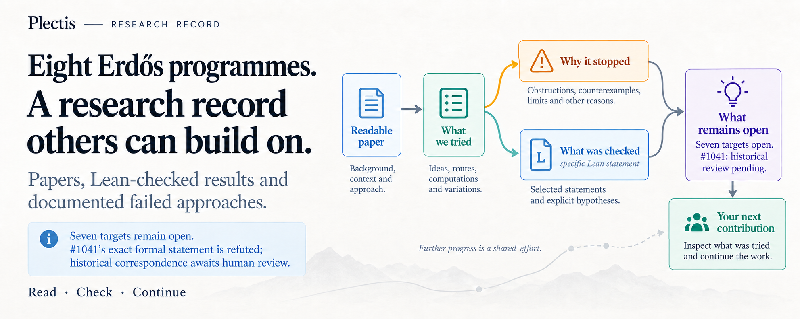

<!-- SPDX-FileCopyrightText: 2026 Will Cook -->
<!-- SPDX-License-Identifier: Apache-2.0 -->

# Plectis: open mathematical research with Lean

Plectis brings together research on eight Erdős problems: papers you can read,
formal proofs you can check, and experiments and failed approaches you can
continue. It is an independent, AI-assisted prototype by Will Cook. Lean checks formal
statements; papers explain the arguments and what remains open.

**[Read the mathematics](https://wcook04.github.io/plectis/maths/)** ·
[All papers](paper/README.md) ·
[Clone and reproduce](docs/REPRODUCIBILITY.md) ·
[Contribute or correct](CONTRIBUTING.md)

## For a first look: #257

**[Try three changed hypotheses](docs/reading-edition/weighted-257-task.md):**
one result, optional hints, a worked answer, and where the test stops. Read
offline or [use an agent](docs/agents/README.md#apply-a-result-to-a-changed-example).

[Problem 257](https://www.erdosproblems.com/257) asks whether adding
`1/(2^a − 1)` over **any infinite set of positive integers** always gives an
irrational number. Our [short paper](paper/257/erdos-257-mersenne-support-subseries.pdf)
proves a sufficient condition that Lean checks: if a set of positive integer exponents
has finite base-two prime-weighted mass, every infinite subset gives an
irrational sum at **every integer base at least two**.

Choose a finite nonempty set of primes `P`, and let `h_P(a)` be the
largest divisor of `a` whose prime factors lie in `P`. For example,
`P = {2}` gives `h_P(12) = 4`. The required bound is
`∑_{a∈H} h_P(a)/(a(2^{h_P(a)}−1)) < ∞` for a set `H` of positive integers.
For every infinite `A ⊆ H` and every integer `b ≥ 2`, the sum
`∑_{a∈A} 1/(b^a−1)` is irrational. The paper constructs sets satisfying this
condition even though `∑_{a∈H} 1/a` diverges; those example calculations are
ordinary proofs. The question for every infinite support remains open.

A second average over dyadic window lengths controls unfinished periods.
Follow the [short proof](paper/257/erdos-257-mersenne-support-subseries.pdf),
[longer proof record](paper/257/erdos257-mersenne-reasoning-surface.pdf),
[Lean declaration](lean/ErdosProblems/Erdos257/PaperCompleteR8/WeightedReturn.lean#L120),
or [selected theorem replay](docs/verification/EXTERNAL_VERIFICATION_REPLAY.md#reviewer-replay).

## Results and their limits

Using the degree-seven polynomial constructed by the erdosproblems.com contributor ani, Lean proves that every preconnected strict-lemniscate set containing two distinct roots has one-dimensional Hausdorff measure greater than two. This refutes the exact Formal Conjectures path-image-length statement; the separate total-variation bound is also checked. The other seven targets remain open. Independent human review of correspondence with the 1958 wording has not been recorded. Comparator checks only selected exact statements, axioms and kernel acceptance; it does not assess novelty or historical correspondence.

[Results and limits](docs/RESULTS.md) gives the current conclusions for every
programme, with assumptions and remaining questions beside them. A finite
calculation establishes its tested range; a conditional theorem retains its
missing premise. Novelty and significance require human judgement.

## Where to start

[A reader's way in](docs/README.md) explains how to work through an argument.
The [paper catalogue](paper/README.md#problem-papers) contains each short paper
and its longer record. [Reproducibility](docs/REPRODUCIBILITY.md) starts with
one claim you can inspect without Lean, then gives calculation and build steps.
Agents enter through [AGENTS.md](AGENTS.md) and the
[agent quickstart](docs/agents/README.md#start-with-current-public-work).

## Why keep the whole research record?

I want other people to work on these questions with me. A checked proof needs
an explanation of why it works and how someone might arrive at it. Longer
records preserve calculations and routes that stopped at a precise obstruction,
so another reader can question the approach, repair it or reuse the idea.
I am responsible for the claims, sources and release. Formal checking,
readable explanation and human understanding remain separate responsibilities.
The [systems paper](paper/systems/claim-faithful-publication-systems-paper.pdf)
examines how results, corrections and credited contributions move through this
public record.

## Problem papers

Choose a question in the [complete paper catalogue](paper/README.md#problem-papers):
[#68](https://www.erdosproblems.com/68), [#243](https://www.erdosproblems.com/243),
[#249](https://www.erdosproblems.com/249), [#251](https://www.erdosproblems.com/251),
[#257](https://www.erdosproblems.com/257), [#269](https://www.erdosproblems.com/269),
[#1041](https://www.erdosproblems.com/1041) or [#1049](https://www.erdosproblems.com/1049).
The [synthesis paper](paper/synthesis/optimal-sparse-perturbations.pdf) develops
connections across the eight; its main arguments are ordinary proofs with
specified Lean-checked ingredients.

## What Lean and Comparator verify

Lean checks the exact formal statement under its assumptions. Comparator
compares selected proofs with separately declared statements and an explicit
axiom budget. [External verification](docs/EXTERNAL_VERIFICATION.md) identifies
those selections, available receipts and replay limits; it does not cover
every paper argument. [Claim records](docs/claims.json) own selected public
wording and status; [Methodology](docs/METHODOLOGY.md) distinguishes formal
validity, claim review and correspondence with the intended mathematics.

## Contribute

A correction, earlier reference, counterexample, useful failed approach or
clearer explanation can help. You need not solve an Erdős problem or write Lean.
[Work on a paper](docs/research-commons/CONTRIBUTE_BY_PAPER.md),
[develop a method](paper/synthesis/README.md), or
[improve the machinery](docs/research-commons/ARCHITECTURE_CONTRIBUTIONS.md).
Use an [issue](https://github.com/wcook04/plectis-erdos/issues/new?template=research_progress.yml)
or [email me](https://wcook04.github.io/plectis/#contact); [Contributing](CONTRIBUTING.md)
explains what to send and how credit is preserved. If you solve a problem, the
credit for your solution is yours. The [credit ledger](docs/research-commons/CREDIT_LEDGER.md)
records adopted advice and its effects; names remain withheld until naming is
approved.

## Read or verify locally

### Repository map

[paper/](paper/README.md) holds manuscripts; [lean/](docs/reference/SOURCE_MAP.md)
holds formal proofs; [research/](research/README.md) holds experiments;
[research_corpus/](research_corpus/README.md) preserves dated returns;
[computations/](computations/README.md) holds exact arithmetic;
[verification/](verification/README.md) and [evidence/](evidence/README.md)
hold checking interfaces and recorded outcomes. [Docs](docs/README.md),
[tools](scripts/README.md) and [skills](skills/README.md) have their own indexes.
[Architecture](docs/ARCHITECTURE.md#directory-and-naming-conventions) explains
folder responsibilities. [The workbench](docs/agents/AGENT_WORKBENCH.md) owns
agent commands; [the source map](docs/reference/SOURCE_MAP.md) locates proofs.
Generated inventory belongs to the [semantic reference](docs/semantic/README.md#corpus-census)
and [corpus descriptor](docs/corpus_descriptor.json), where counts retain their
limits. Counts of declarations do not measure mathematical importance.

## Citation and licence

Use [CITATION.cff](CITATION.cff) and record the commit used. For mathematics,
cite the relevant paper and original sources; repository credit does not
replace source attribution. [Prior art](docs/PRIOR_ART.md) and
[source attributions](docs/research-commons/SOURCE_ATTRIBUTIONS.md) preserve
those relationships. [Formal Conjectures contributions](docs/case-studies/formal-conjectures-1041.md)
and [verification records](docs/verification/README.md) describe selected
external outcomes; archived editions may differ from current papers.

Code, scripts and documentation are Apache-2.0; manuscripts and PDFs are
CC-BY-4.0. [REUSE.toml](REUSE.toml) records exceptions. See
[scope](docs/METHODOLOGY.md#release-scope), [privacy](docs/PRIVACY.md),
[security](.github/SECURITY.md) and the [code of conduct](.github/CODE_OF_CONDUCT.md).
